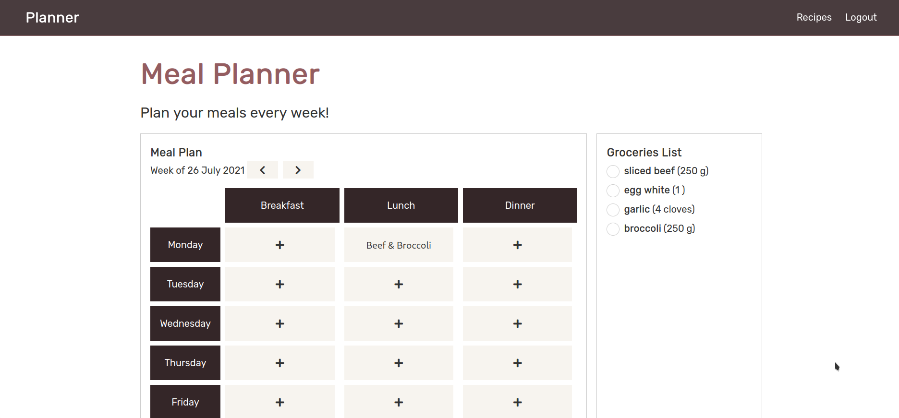
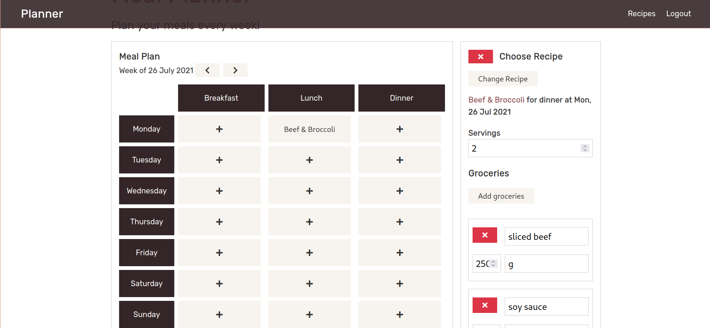
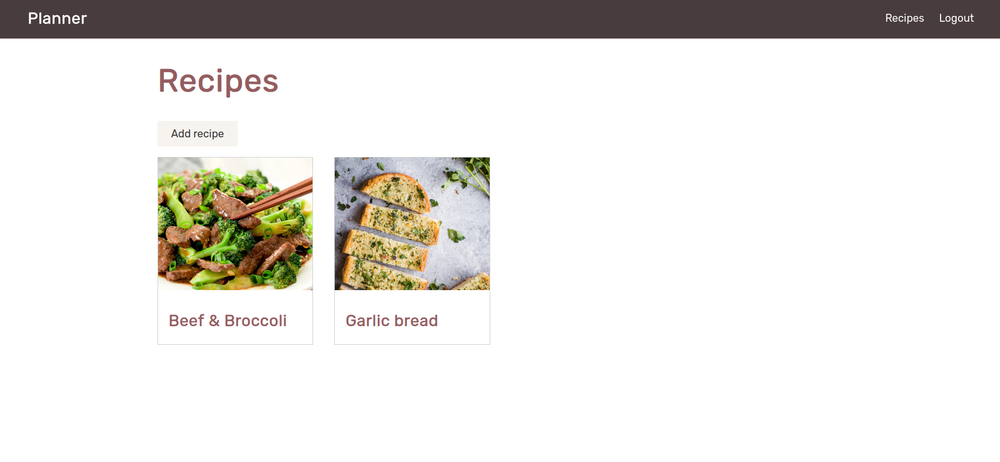
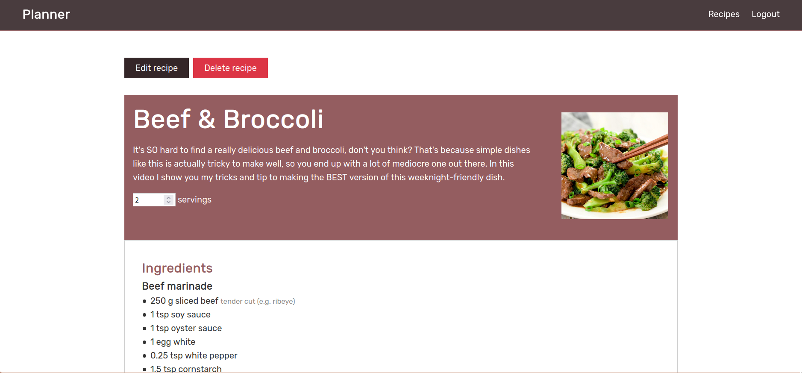
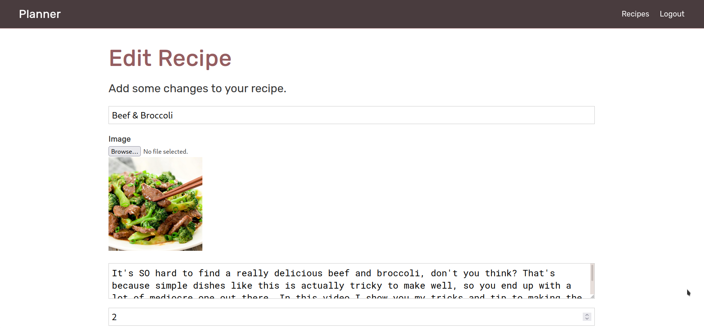

# Meal Planner

Live demo: https://mangosteen-app.herokuapp.com/

Meal planner is a web application that helps users track their meal planning. The user is able to add their recipes to the 'Recipes' page.
The 'Recipes' page is accessible to everyone but only the writer can edit and/or delete their recipes.

Then, the user is able to add the recipes into their calendar week. By selecting a recipe in a slot (ex. Monday, dinner), the system fetches the recipe ingredients list and the user is able to modify, add, or remove them. Once the user is done editting, the meal is added to the calendar and the ingredients are listed in the groceries list for the week.

This web application uses HTML/SASS/CSS/React JS for the front end, Express/Node JS for the back end, and MongoDB for database.
This app also uses Cloudinary for image storage, allowing users to upload their recipe photo.

## API endpoints

### Users/Authentication

| Endpoint        | Description      |
| --------------- | ---------------- |
| POST /api/users | Register user    |
| POST /api/auth  | Login            |
| GET /api/auth   | Get user details |

### Recipes

| Endpoint                       | Description                |
| ------------------------------ | -------------------------- |
| GET /api/recipes               | Get all recipes            |
| GET /api/recipes/:recipe_id    | Get recipe by ID           |
| POST /api/recipes              | Create a new recipe        |
| PUT /api/recipes/:recipe_id    | Edit recipe from recipe ID |
| DELETE /api/recipes/:recipe_id | Delete recipe by ID        |

### Meals

| Endpoint                   | Description      |
| -------------------------- | ---------------- |
| GET /api/meals             | Get all meals    |
| GET /api/meals/:meal_id    | Get meal by ID   |
| POST /api/meals            | Add meal plan    |
| PUT /api/meals/:meal_id    | Edit meal plan   |
| DELETE /api/meals/:meal_id | Delete meal plan |

## Screenshots

### Planner

### Edit meal

### Recipes list

### Recipe page

### Edit/Add recipe

## Todo list

In the future, I'd like to implement these features:

- UI that adapts to mobile devices
- Better planner UI
- Search engine for recipes
- A more efficient way to store and show groceries & ingredients
